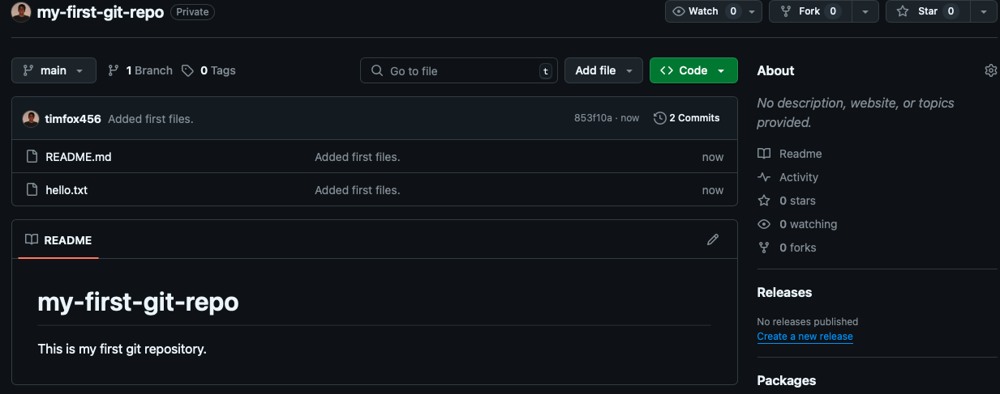

Lab 1: Git Fundamentals - Your First Repository Workflow

**Objective:** This lab introduces the core Git workflow: creating a remote repository, cloning it locally, making changes, staging, committing, pushing to GitHub, and pulling updates. You will learn to perform these actions using both the command line and VS Code's integrated Git features.

**Prerequisites:**

- A GitHub account.
    
- Git installed on your system.
    
- VS Code installed on your system.
    
- Basic familiarity with your operating system's terminal/command prompt.
    

---

### Exercise 1.1: Setting Up Your Repository

**Goals:**

- Create a new empty repository on GitHub.
    
- Clone the repository to your local machine.
    

**Steps:**

1. **Create a New Repository on GitHub:**
    
    - Go to [github.com](https://github.com/) and log in.
        
    - Click the **'+' icon** in the top right corner (or "New" button on your profile).
        
    - Select **"New repository"**.
        
    - **Repository name:** `my-first-git-repo` (or choose your own, but remember it).
        
    - **Description (Optional):** "A simple repo for Git lab exercises."
        
    - **Public/Private:** Choose `Public` (simpler for this lab).
        
    - **Initialize this repository with:** Check `Add a README file`. (This is important; it gives us something to pull later).
        
    - **Add .gitignore:** None.
        
    - **Choose a license:** None.
        
    - Click **"Create repository"**.
        
2. **Clone the Repository to Your Local Machine (Command Line):**
    
    - On your new GitHub repository page, click the green **"<> Code"** button.
        
    - Select the **HTTPS** tab.
        
    - Click the **copy icon** next to the URL (e.g., `https://github.com/your-username/my-first-git-repo.git`).
        
    - Open your terminal/command prompt (e.g., Git Bash, macOS Terminal, Windows Command Prompt/PowerShell).
        
    - Navigate to a directory where you want to store your projects (e.g., `cd ~/Documents/Projects` or `cd C:\Users\YourUser\Documents\Projects`).
        
    - Execute the `git clone` command, pasting the URL you copied:
        
        
        ```bash
        git clone https://github.com/your-username/my-first-git-repo.git
        ```
        
    - **Expected Output:** You'll see messages indicating the cloning process. A new directory named `my-first-git-repo` (or whatever you named your repo) will be created.
        
    - Navigate into the newly cloned directory:
        
        
        ```bash
        cd my-first-git-repo
        ```
        
3. **Open the Cloned Repository in VS Code:**
    
    - From your terminal (while inside the `my-first-git-repo` directory), type:
        
        
        ```bash
        code .
        ```
        
    - **Expected Output:** VS Code will open, displaying the `my-first-git-repo` folder in the Explorer view on the left, containing `README.md`.
        

---

### Exercise 1.2: Making, Staging, and Committing Changes

**Goals:**

- Create a new file and modify an existing one.
    
- Stage changes for commit using both command line and VS Code.
    
- Commit changes with a descriptive message.
    

**Steps:**

1. **Create a New File (VS Code):**
    
    - In VS Code's Explorer, right-click inside the `my-first-git-repo` folder (but not on `README.md`).
        
    - Select **"New File..."**.
        
    - Name the file `hello.txt`.
        
    - Type `Hello, Git!` into `hello.txt` and save it (`Ctrl+S` or `Cmd+S`).
        
2. **Modify an Existing File (VS Code):**
    
    - Open `README.md` in VS Code.
        
    - Add a new line at the end, e.g., `This is my first Git repository.`
        
    - Save `README.md`.
        
3. **Check Git Status (Command Line):**
    
    - Go back to your terminal, ensuring you are in the `my-first-git-repo` directory.
        
    - Run:
        
        
        ```bash
        git status
        ```
        
    - **Expected Output:** You will see `hello.txt` listed under "Untracked files" and `README.md` under "Changes not staged for commit."
        
4. **Stage Changes (Command Line):**
    
    - Stage both files for the next commit:
        
        
        ```bash
        git add hello.txt README.md
        # OR to stage all modified/untracked files:
        # git add .
        ```
        
    - Run `git status` again to verify.
        
    - **Expected Output:** Both files should now be listed under "Changes to be committed."
        
5. **Commit Changes (Command Line):**
    
    - Commit the staged changes with a message:
        
        
        ```bash
        git commit -m "Add hello.txt and update README"
        ```
        
    - **Expected Output:** A message confirming the commit, like `[main e1a4f2b] Add hello.txt and update README`.
        
6. **Alternative: Stage and Commit Changes (VS Code):**
    
    - **Undo the previous commit** if you want to practice with VS Code:
        
        - In your terminal, run `git reset HEAD~1` (this will un-commit the changes but keep them in your working directory).
            
        - Run `git status` to see the files are back to "Changes not staged for commit" and "Untracked files."
            
    - In VS Code, click the **Source Control icon** (the three circles, often with a badge indicating pending changes) in the left sidebar.
        
    - You'll see `hello.txt` and `README.md` listed under "Changes."
        
    - **To Stage:** Hover over each file and click the **'+' icon** next to it, or click the **'+' icon** next to "Changes" to stage all. They will move to "Staged Changes."
        
    - **To Commit:** Type a commit message (e.g., `Add initial files via VS Code`) in the message box at the top of the Source Control view.
        
    - Click the **Commit button** (the checkmark icon) above the message box.
        
    - **Expected Output:** The "Changes" and "Staged Changes" sections should clear.
        

---

### Exercise 1.3: Pushing and Pulling Changes

**Goals:**

- Push local commits to the remote GitHub repository.
    
- Simulate an external change on GitHub.
    
- Pull remote changes to your local repository.
    

**Steps:**

1. **Push Changes to GitHub (Command Line):**
    
    - Go back to your terminal, in your repo directory.
        
    - Push your committed changes to the `main` branch on GitHub:
        
        
        ```bash
        git push origin main
        ```
        
    - **Expected Output:** Messages indicating the push was successful (e.g., `To github.com/...`, `[new branch] main -> main`).
        
    - **Verification:** Go to your GitHub repository in your web browser. You should now see `hello.txt` and the updated `README.md` with your commit message.

    - You can now look at your repo on github


        
2. **Alternative: Push Changes to GitHub (VS Code):**
    
    - If you just committed via VS Code, click the **"..." (More Actions)** menu in the Source Control sidebar.
        
    - Select **"Push"**.
        
    - **Expected Output:** A notification in VS Code confirming the push.
        
    - **Verification:** Check your GitHub repository in the browser.
        
3. **Simulate an External Change on GitHub:**
    
    - On your GitHub repository page, click on `hello.txt`.
        
    - Click the **pencil icon** to edit the file directly in the browser.
        
    - Add a new line, e.g., `This line was added on GitHub!`
        
    - Scroll down and click **"Commit changes"** (leave the default commit message).
        
4. **Check Local Status (Command Line):**
    
    - Go back to your terminal.
        
    - Run `git status`.
        
    - **Expected Output:** `Your branch is behind 'origin/main' by 1 commit, and can be fast-forwarded.` This tells you there's a change on GitHub you don't have locally.
        
5. **Pull Changes from GitHub (Command Line):**
    
    - Pull the changes from the remote `main` branch:
        
        
        ```bash
        git pull origin main
        ```
        
    - **Expected Output:** Git will download the change and apply it. You'll see `Updating ...` messages.
        
    - **Verification:** Open `hello.txt` in VS Code. You should see the new line added from GitHub.
        
6. **Alternative: Pull Changes from GitHub (VS Code):**
    
    - If you just simulated an external change, in VS Code's Source Control view, click the **Synchronize Changes** button (the circular arrows icon at the bottom left, or in the "..." menu, select "Pull").
        
    - **Expected Output:** A notification confirming the pull.
        
    - **Verification:** `hello.txt` in VS Code should update.
        

