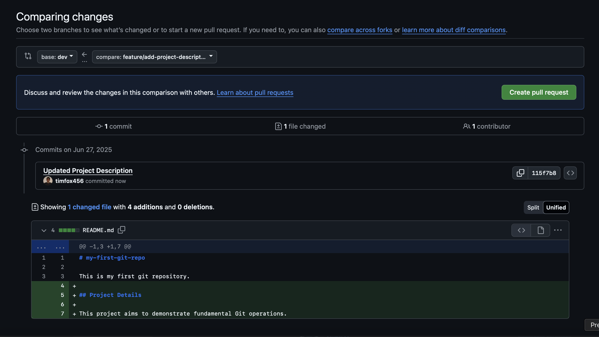
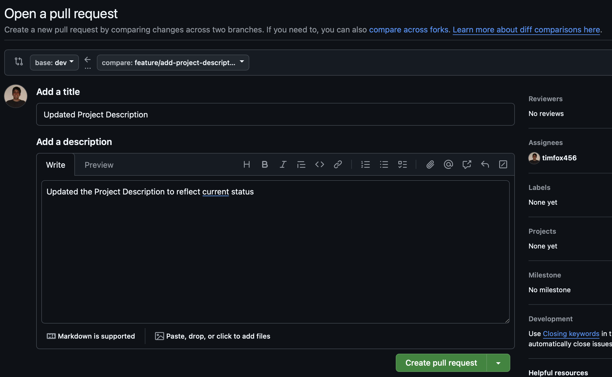
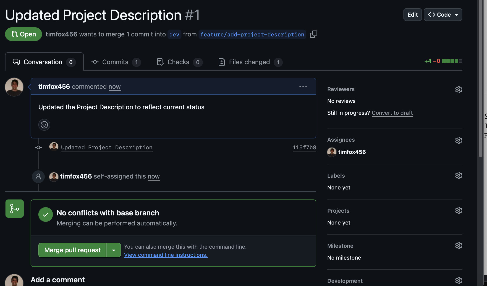

### Exercise 2.1: Creating and Working on Branches

**Goals:**

- Create a `dev` branch for ongoing development.
    
- Create a feature branch from `dev`.
    
- Make, stage, and commit changes on the feature branch.
    

**Steps:**

1. **Ensure you are on the `main` branch and up-to-date:**
    
    - Open your `my-first-git-repo` (or equivalent) in VS Code.
        
    - Open your terminal, navigate to the repo directory.
        
    - Run:
        
        
        ```bash
        git checkout main
        git pull origin main
        ```
        
    - **Expected Output:** `Already on 'main'` or `Switched to branch 'main'`. `Already up to date.` or pull messages.
        
2. **Create a `dev` Branch (Command Line):**
    
    - From `main`, create a new branch named `dev`:
        
        
        ```bash
        git branch dev
        git checkout dev
        # OR in one go:
        # git checkout -b dev
        ```
        
    - **Expected Output:** `Switched to a new branch 'dev'`.
        
3. **Push `dev` Branch to GitHub (Command Line):**
    
    - The `dev` branch only exists locally. Push it to create it on GitHub:
        
        
        ```bash
        git push -u origin dev
        ```
        
    - **Expected Output:** Messages about a new branch being created on `origin`.
        
    - **Verification:** Check your GitHub repo in the browser. You should now see a dropdown to switch branches, and `dev` should be available.
        
4. **Create a Feature Branch from `dev` (Command Line):**
    
    - Ensure you are on `dev` (`git branch` should show `* dev`).
        
    - Create a new feature branch (e.g., for adding a new project description):
        
        
        ```bash
        git checkout -b feature/add-project-description
        ```
        
    - **Expected Output:** `Switched to a new branch 'feature/add-project-description'`.
        
5. **Alternative: Create a Branch (VS Code):**
    
    - In VS Code, look at the **bottom-left status bar**. You'll see the current branch name (e.g., `main` or `dev`).
        
    - Click on the **branch name**. A quick-pick menu will appear at the top.
        
    - Select **"Create new branch..."**.
        
    - Type the new branch name (e.g., `feature/add-another-thing`).
        
    - Press Enter. You will be prompted to "Publish Branch" - choose **"Publish Branch"**.
        
    - **Expected Output:** The branch name in the status bar will change to your new feature branch.
        
6. **Make Changes on Your Feature Branch (VS Code):**
    
    - Open `README.md` in VS Code.
        
    - Add a new section, e.g.:
        
        ```
        ## Project Details
        
        This project aims to demonstrate fundamental Git operations.
        ```
        
    - Save `README.md`.
        
7. **Stage and Commit Changes on Feature Branch (VS Code):**
    
    - Go to the **Source Control icon** in VS Code.
        
    - Stage the `README.md` change by clicking the `+` icon.
        
    - Type a commit message: `FEAT: Add project details section to README`.
        
    - Click the **Commit** button (checkmark icon).
        
8. **Push Feature Branch to GitHub (Command Line):**
    
    - Go back to your terminal, in your repo directory.
        
    - Push your feature branch and its commits to GitHub:
        
        
        ```bash
        git push origin feature/add-project-description
        ```
        
    - **Expected Output:** Messages confirming the creation of the new branch on `origin`.
        
    - **Verification:** Go to your GitHub repository in your web browser. You should see a notification about your new branch, or you can use the branch dropdown to select `feature/add-project-description` and see your changes.
        

---

### Exercise 2.2: Creating and Merging a Pull Request

**Goals:**

- Initiate a Pull Request from your feature branch to the `dev` branch on GitHub.
    
- Review and merge the Pull Request.
    
- Update your local `dev` branch with the merged changes.
    
- Clean up the local feature branch.
    

**Steps:**

1. **Create a Pull Request on GitHub:**
    
    - On your GitHub repository page, after pushing your feature branch, you'll often see a banner like "Compare & pull request" – click this.


        
    - If not, go to the **"Pull requests" tab** on your repo page.
        
    - Click the green **"New pull request"** button.
        
    - **Base branch:** Set this to `dev`.
        
    - **Compare branch:** Set this to `feature/add-project-description` (your feature branch).
        
    - Review the changes shown.
        
    - Add a descriptive title (e.g., `FEAT: Add project details for review`).
        
    - Add a description (e.g., `Adds a new "Project Details" section to the README as part of feature X.`).
        
    - Click **"Create pull request"**.

        
2. **Review and Merge the Pull Request (on GitHub):**
    
    - On the Pull Request page, you can see the "Files changed" tab to review the code.
        
    - Since this is your own repo and for practice, you can self-approve.
        
    - Click the green **"Merge pull request"** button.
        
    - Click **"Confirm merge"**.
        
    - **Expected Output:** The PR status will change to "Merged," and GitHub will offer to "Delete branch." Click this button to clean up the remote feature branch.

        
3. **Switch to `dev` Branch Locally and Pull Changes (Command Line):**
    
    - Go back to your terminal, in your repo directory.
        
    - Switch to your local `dev` branch:
        
        
        ```bash
        git checkout dev
        ```
        
    - Pull the changes that were just merged into `dev` on GitHub:
        
        ```bash
        git pull origin dev
        ```
        
    - **Expected Output:** Git will show that it fetched and merged the changes.
        
    - **Verification:** Open `README.md` in VS Code. It should now contain the "Project Details" section.
        
4. **Alternative: Switch Branch and Pull (VS Code):**
    
    - In VS Code's bottom-left status bar, click the current branch name (e.g., `feature/add-project-description`).
        
    - Select `dev` from the quick-pick menu to switch.
        
    - Once on `dev`, click the **Synchronize Changes** button (circular arrows icon) in the bottom status bar to pull.
        
5. **Delete Local Feature Branch (Command Line):**
    
    - Once your feature has been merged into `dev` and pulled locally, you can delete your local feature branch as it's no longer needed.
        
    - Ensure you are on the `dev` branch (you cannot delete the branch you are currently on).
        
    - Run:
        
        
        ```bash
        git branch -d feature/add-project-description
        ```
        
    - **Expected Output:** `Deleted branch feature/add-project-description (was <commit-hash>).`
        

**Conclusion:**

You've now practiced the full basic Git workflow and a simplified branching/PR workflow crucial for team collaboration. Remember that consistent `git pull` on your main/development branches is important to stay updated, and always create new branches for new features or bug fixes!
